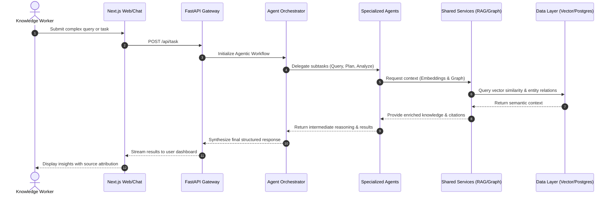

# 🧠 MedBOT

<p align="center">
  <strong>Enterprise-grade Agentic AI platform for autonomous organizational intelligence, workflows, and decision support.</strong>
</p>

<p align="center">
  
  
  
  
  
  
  
</p>

---

## 🚀 Why MedBOT?

Organizations struggle with information silos, manual workflows, and decision latency. MedBOT solves this by acting as an autonomous workforce that understands your company's knowledge (documents, emails, meeting notes) and executes intelligent tasks. 

By combining **Retrieval-Augmented Generation (RAG)** with a **Multi-Agent Architecture**, MedBOT goes beyond simple chat—it plans, retrieves, analyzes, and automates.

- **Multi-Agent Orchestration**: Specialized AI agents (Query, Document, Workflow, Analysis, Planning) collaborate seamlessly to solve complex objectives.
- **Deep Document Understanding**: Native support for processing and indexing PDFs, DOCX, XLSX, HTML, and Emails with incremental indexing.
- **Enterprise-Grade RAG & Knowledge Graph**: Combines vector similarity search with Neo4j relationship mapping for verifiable, hallucination-free answers complete with source citations.
- **Visual Workflow Automation**: Trigger actions (e.g., Slack notifications, Jira tickets, automated reports) based on events, schedules, or data thresholds.
- **Secure & Multi-Tenant**: Designed from the ground up for SOC 2 and GDPR compliance, featuring encrypted shared memory and human-in-the-loop approval gates.

---

## 🛠️ Architecture & Data Flow

MedBOT separates presentation, orchestration, and data layers to ensure independent scaling of specialized agents and robust security.



---

## ✨ Key Features & Agent Ecosystem

### 1. 🤖 The Agent Fleet
- **Query Agent**: Handles natural language interactions and routes intent.
- **Document Agent**: Ingests, chunks, and extracts metadata from diverse file formats.
- **Planning Agent**: Breaks complex, multi-step goals into actionable dependency trees.
- **Analysis Agent**: Synthesizes data into structured reports and identifies trends.
- **Workflow Agent**: Executes automated tasks via APIs and webhooks.

### 2. 🧠 Hybrid Knowledge Engine
- Seamlessly fuses **Vector Databases** (Pinecone/Chroma) for semantic search and **Graph Databases** (Neo4j) for entity relationship mapping.

### 3. 🛡️ Trust & Verification
- **Source Attribution**: Every fact provided by MedBOT includes a direct citation to the underlying organizational document.
- **Human-in-the-Loop**: High-stakes workflows pause for explicit management approval before taking destructive or external actions.

---

## 📂 Directory Structure

```text
MedBOT/
├── frontend/               # Next.js React application (UI, Chat Widget, Dashboard)
├── backend/                # FastAPI Python server (API Gateway & Core Logic)
│   ├── agents/             # LangGraph/CrewAI agent definitions and tools
│   ├── api/                # REST endpoints and websocket handlers
│   ├── core/               # Shared logic, auth, and orchestrator 
│   └── services/           # RAG pipelines, graph builders, document parsers
├── chroma_db/              # Local vector database storage (Development)
├── docs/                   # Documentation, Architecture Diagrams, and PRDs
├── scripts/                # Utility scripts for database setup and migrations
├── docker-compose.yml      # Container orchestration for local development
└── README.md               # You are here!
```

---

## ⚙️ Setup & Installation

### Prerequisites
- **Node.js** $\ge$ 18
- **Python** $\ge$ 3.10
- **Docker** & **Docker Compose** (For databases)
- **Git**

### 1. Clone the Repository
```bash
git clone https://github.com/YourOrg/MedBOT.git
cd MedBOT
```

### 2. Environment Configuration
Copy the sample environment files and configure your API keys (OpenAI, DB credentials):
```bash
cp backend/.env.example backend/.env
cp frontend/.env.example frontend/.env
```

### 3. Start Infrastructure (Databases)
Spin up PostgreSQL, Neo4j, and Redis using Docker:
```bash
docker-compose up -d
```

### 4. Setup Backend (FastAPI)
```bash
cd backend
python -m venv .venv
source .venv/bin/activate  # On Windows: .venv\Scripts\activate
pip install -r requirements.txt
python -m scripts.init_db  # Run database migrations
cd ..
```

### 5. Setup Frontend (Next.js)
```bash
cd frontend
npm install
cd ..
```

---

## 🏃 Run Locally

To run the full stack locally for development:

**Terminal 1 (Backend):**
```bash
cd backend
source .venv/bin/activate
uvicorn main:app --reload --port 8000
```

**Terminal 2 (Frontend):**
```bash
cd frontend
npm run dev
```

Open **[http://localhost:3000](http://localhost:3000)** in your browser to access the MedBOT dashboard!

---

## 📜 License

This project is licensed under the MIT License — see the [LICENSE](LICENSE) file for details.