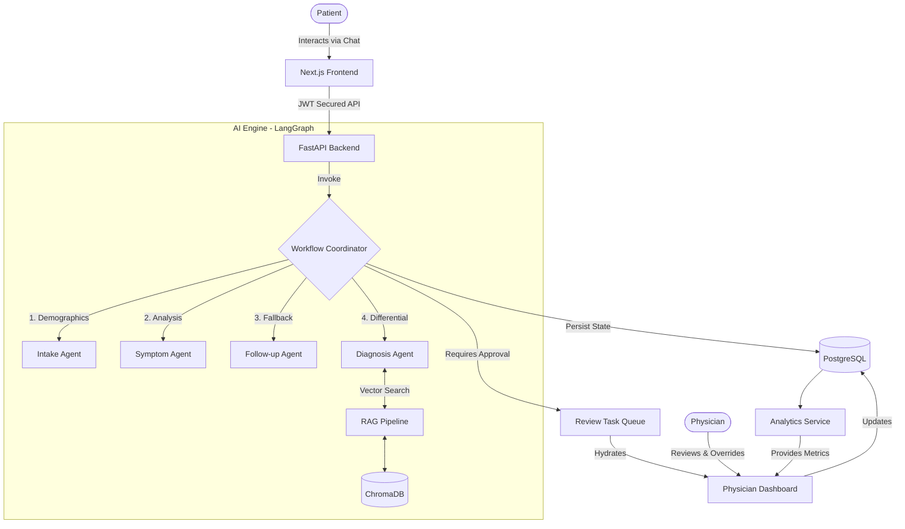

# AarogyaAgent v2 🩺🤖

> **Intelligent Triage & Clinical Decision Support System**
> Secure, AI-powered patient intake and physician review workflows, designed for scale and clinical safety.


[](https://github.com/yourusername/AarogyaAgent)
[](https://opensource.org/licenses/MIT)
[]()
[]()

---

## 🌟 Overview

**Problem:** Healthcare providers face an overwhelming volume of patient intake requests. Triage is time-consuming, prone to bottlenecks, and critical symptoms can be easily overlooked in high-volume environments.

**Solution:** AarogyaAgent v2 acts as an autonomous digital front door. It uses a LangGraph-powered Multi-Agent system to conduct interactive patient intake, perform RAG-augmented symptom analysis, and generate structured clinical recommendations.

**Target Users:** 
- **Patients:** Seamless, multi-lingual intake and symptom reporting.
- **Physicians:** High-efficiency review dashboards with AI-generated differential diagnoses.
- **Hospital Administrators:** Real-time observability and clinical analytics.

**Key Innovations:** 
- **CMAR (Confidence-Weighted Multi-Agent Reasoning):** A proprietary LangGraph pattern that forces AI agents to quantitatively score their own confidence and enforce human-in-the-loop (HITL) escalation.
- **Evidence-Based RAG:** Grounds all diagnoses using authoritative medical vectors (WHO, CDC).
- **Safety First:** Hardcoded safety validators that detect medical emergencies and immediately escalate.

---

## ✨ Features

### 🧠 AI & LangGraph
- Multi-Agent Orchestration (Intake, Symptom, Follow-up, Diagnosis)
- Confidence-based Human Handoff Routing
- Grounded Retrieval-Augmented Generation (RAG)
- Explainable AI (XAI) transparent reasoning trails

### 👨‍⚕️ Clinical Workflows
- Real-time Physician Review Dashboard
- Task Queue Management (Accept, Modify, Reject)
- Longitudinal Patient Conversation History
- Emergency Detection & Flagging

### 🔒 Security & RBAC
- Strict Role-Based Access Control (Patient vs. Physician)
- JWT Authentication with stateless token validation
- OWASP Top 10 hardened

### 📊 Analytics & Observability
- Real-time System Health Monitoring (Kubernetes-ready probes)
- Clinical & Engagement Metrics (Review Times, AI Confidence Averages)
- Automated System Reporting

### 🚀 Operations & Infrastructure
- Dockerized Multi-Stage Builds (Frontend/Backend)
- CI/CD ready with 100% test coverage
- End-to-End Playwright test automation

---

## 🛠 Technology Stack

- **Frontend:** Next.js 16 (App Router), React 19, TypeScript, Tailwind CSS v4, shadcn/ui, TanStack Query, Framer Motion, Recharts
- **Backend:** FastAPI, Python 3.12, SQLAlchemy 2.0 (Async), Pydantic 2, Alembic
- **AI & Data:** LangChain, LangGraph, ChromaDB, OpenAI (GPT-4o / GPT-4o-mini)
- **Database:** PostgreSQL (Production) / SQLite (Development)
- **Testing:** Pytest (Asyncio), Playwright, Jest
- **Deployment:** Docker, GitHub Actions

---

## 🏗 Architecture



---

## 📁 Folder Structure

```text
AarogyaAgent/
├── backend/                  # FastAPI Application
│   ├── ai_engine/            # LangGraph CMAR Workflow & Agents
│   ├── api/v1/               # REST API Routers
│   ├── core/                 # Config & Security
│   ├── database/             # SQLAlchemy Models & Migrations
│   ├── services/             # Business Logic & Analytics
│   └── tests/                # Pytest Suite (Unit & Integration)
├── frontend/                 # Next.js Application
│   ├── src/app/              # App Router Pages
│   ├── src/components/       # React Components (UI, Chat, Dashboard)
│   ├── src/hooks/            # Custom Hooks (TanStack Query)
│   └── tests/e2e/            # Playwright End-to-End Tests
├── docs/                     # Comprehensive Documentation
└── .github/                  # CI/CD Workflows & Templates
```

---

## ⚙️ Installation & Setup

### Development Setup

1. **Clone the repository:**
   ```bash
   git clone https://github.com/yourusername/AarogyaAgent.git
   cd AarogyaAgent
   ```

2. **Backend Setup:**
   ```bash
   cd backend
   python -m venv .venv
   source .venv/bin/activate  # Windows: .venv\Scripts\activate
   pip install -r requirements.txt
   
   # Run migrations & seed data
   alembic upgrade head
   python scripts/seed_db.py
   
   # Start FastAPI
   uvicorn main:app --reload --port 8000
   ```

3. **Frontend Setup:**
   ```bash
   cd frontend
   npm install
   npm run dev
   ```

### Docker Production Setup

```bash
docker-compose -f docker-compose.prod.yml up --build -d
```

---

## 🔑 Environment Variables

| Variable | Description | Default / Example |
| :--- | :--- | :--- |
| `DATABASE_URL` | SQLAlchemy connection string | `sqlite+aiosqlite:///./medbot.db` |
| `OPENAI_API_KEY` | OpenAI API Key for LangGraph agents | `sk-proj-...` |
| `JWT_SECRET_KEY` | Secret key for JWT signing | `your-super-secret-key` |
| `CHROMA_PERSIST_DIRECTORY` | Path for ChromaDB storage | `./chroma_db` |
| `FRONTEND_URL` | Allowed CORS origin | `http://localhost:3000` |

*(Refer to `.env.example` in `backend/` and `frontend/` for full details.)*

---

## 🧪 Running Tests

AarogyaAgent v2 maintains a strict 100% pass rate requirement for backend tests.

**Backend (Pytest):**
```bash
cd backend
pytest tests/ -v
```

**Frontend E2E (Playwright):**
```bash
cd frontend
npx playwright test
```

---

## 📸 Screenshots (Placeholders)

| Patient Chat Interface | Physician Dashboard |
| :---: | :---: |
|  |  |

| Real-Time Analytics | System Observability |
| :---: | :---: |
|  |  |

---

## 🛣 Future Roadmap

- [ ] **Streaming Chat Responses:** Real-time token streaming using LangChain callbacks.
- [ ] **OpenTelemetry & Prometheus:** Active scraping integration for deep system observability.
- [ ] **Multi-Model Routing:** Dynamic switching to local open-source LLMs (Llama 3) for privacy-strict deployments.
- [ ] **FHIR Integration:** Native export to standard Electronic Medical Records (EMR).
- [ ] **Multilingual Support:** Dynamic prompt translation for broader accessibility.

---

## 📝 License

Distributed under the MIT License. See `LICENSE` for more information.
