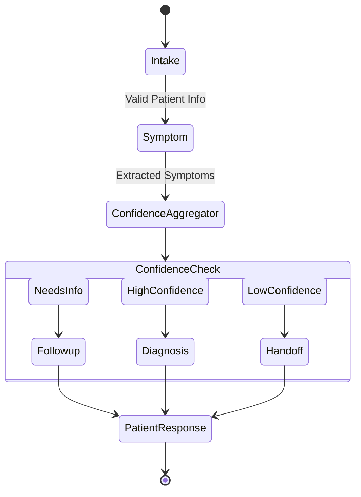

# AI Engine Architecture

## Overview
The AI Engine powers the core triage capabilities of AarogyaAgent v2. It is built using LangGraph, enabling deterministic state management across multiple conversational AI agents.

## CMAR Architecture
AarogyaAgent v2 implements **Confidence-Weighted Multi-Agent Reasoning (CMAR)**. Every agent is required to output a quantitative `confidence_score` and explicit `uncertainty_factors`.

## Agents & Responsibilities

1. **Intake Agent:** Extracts demographic information (age, gender, location).
2. **Symptom Agent:** Extracts and maps natural language complaints to standardized medical ontology symptoms.
3. **Diagnosis Agent:** Uses RAG to search vector stores, formulate a differential diagnosis, and assign urgency levels.
4. **Follow-up Agent:** Formulates clarifying questions if the confidence aggregator determines the state is ambiguous.

## RAG Pipeline (Retrieval-Augmented Generation)
The Diagnosis Agent employs RAG:
1. Embeds extracted symptoms using OpenAI `text-embedding-v3-small`.
2. Queries ChromaDB for matching medical guidelines (e.g., WHO standards).
3. Injects retrieved chunks into the LLM prompt context to ground the differential diagnosis.

## Safety & Fallbacks
- **Safety Validators:** Pre-generation and post-generation validators scan for emergency keywords (e.g., "chest pain", "suicide"). If detected, the workflow immediately routes to `handoff`.
- **Explainability (XAI):** The `audit_trail` module logs every state mutation and confidence score change, rendering an explainability graph in the frontend.
