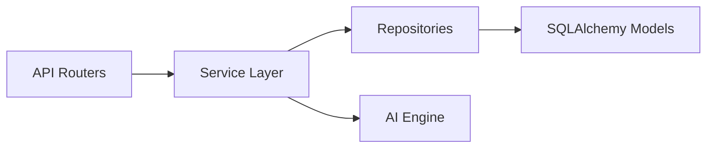

# Backend Architecture

## Overview
The backend is built with FastAPI and strictly adheres to domain-driven design principles. It exposes RESTful endpoints for the frontend while orchestrating the AI LangGraph engine internally.

## Layered Design

1. **Routers (`api/v1/`)**: Purely handles HTTP requests, parameter validation (Pydantic), and HTTP exceptions.
2. **Services (`services/`)**: Contains business logic, authorization checks, and orchestrates calls between Repositories and the AI Engine.
3. **Repositories (`repositories/`)**: Abstracts SQLAlchemy `AsyncSession` operations.
4. **Models (`database/models/`)**: SQLAlchemy 2.0 ORM definitions.

## Key Services
- **ChatService:** Manages conversation persistence and invokes the AI engine.
- **ReviewService:** Manages the physician queue for tasks that were escalated by the AI.
- **MetricsService:** Aggregates analytics data for the `/dashboard/analytics` views.

## Database Strategy
- Uses asynchronous SQLAlchemy (`ext.asyncio`).
- Migrations are managed by Alembic (`alembic/versions`).
- The application implements the SAVEPOINT pattern during testing to ensure full state rollback between tests, guaranteeing zero test cross-contamination.
