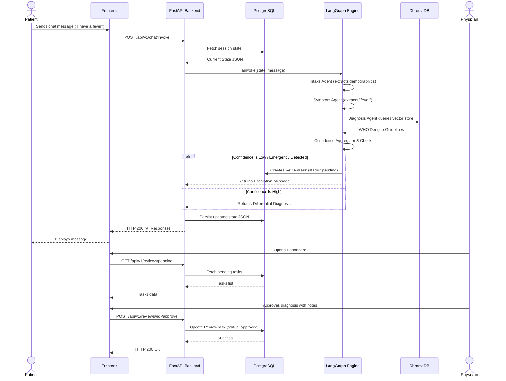

# Data Flow Architecture

## Overview
This document illustrates the flow of data through AarogyaAgent v2 during a standard patient triage interaction and subsequent physician review.

## Sequence Diagram: Patient Intake to Physician Review

## Data Lifecycle

### 1. Ephemeral State
During the execution of a LangGraph turn, state mutations are kept in memory and managed deterministically by the Graph's Reducers.

### 2. Persistent State
At the conclusion of the graph execution, the entire state dictionary (including chat history, extracted symptoms, and confidence schemas) is serialized to JSON and persisted to the `ChatSession` table in PostgreSQL.

### 3. Asynchronous Tasks
When a physician updates a `ReviewTask`, the backend modifies the task row. The `MetricsService` independently queries these rows to generate aggregated analytics.
