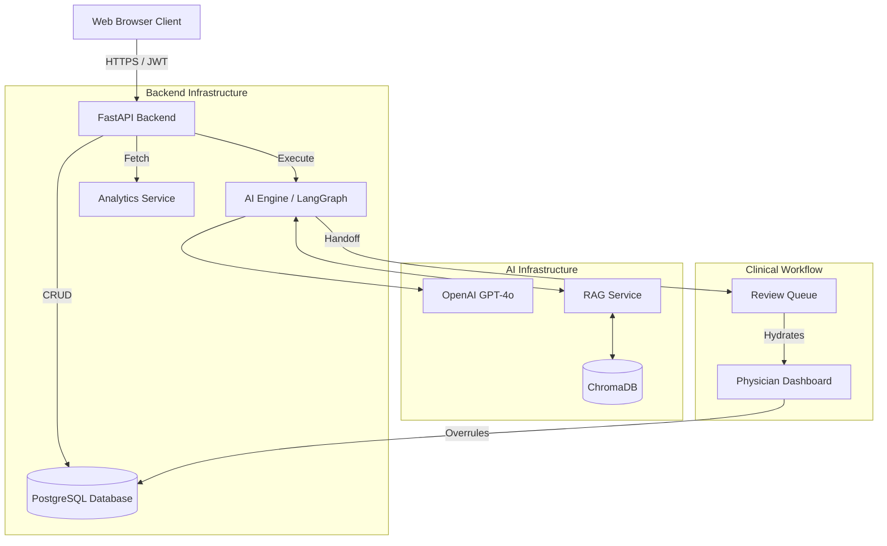

# System Architecture

## Overview
AarogyaAgent v2 is a modern, decoupled web application consisting of a React-based frontend and a Python-based asynchronous backend. It leverages an advanced LangGraph-orchestrated AI engine for clinical decision support.

## High-Level Architecture Diagram

## Core Components

### 1. Presentation Layer (Frontend)
- **Framework:** Next.js 16 (App Router)
- **State Management:** TanStack Query for asynchronous state, React Hook Form for synchronous state.
- **Styling:** Tailwind CSS v4 + shadcn/ui
- **Responsibility:** Provide distinct interfaces for Patients (Chat) and Physicians (Dashboard).

### 2. Application Layer (Backend)
- **Framework:** FastAPI
- **Architecture:** Layered (Routers -> Services -> Repositories -> Models)
- **Responsibility:** Handle authentication, route requests, manage database transactions, and interface with the AI engine.

### 3. AI Engine Layer
- **Framework:** LangGraph / LangChain
- **Architecture:** Confidence-Weighted Multi-Agent Reasoning (CMAR)
- **Responsibility:** Manage conversational state, orchestrate agents (Intake, Symptom, Diagnosis), compute confidence scores, and enforce Human-in-the-Loop constraints.

### 4. Data Layer
- **Relational DB:** PostgreSQL (via SQLAlchemy / asyncpg) storing users, chat sessions, review tasks, and metrics.
- **Vector DB:** ChromaDB storing medical guidelines and literature for RAG.

## Design Decisions & Trade-offs
- **Async Python:** Selected `asyncio` with FastAPI for high-concurrency websocket and LLM streaming potential, trading off synchronous simplicity.
- **LangGraph vs Native LLM calls:** LangGraph adds complexity but ensures deterministic state transitions, critical for medical compliance and fallback safety.
- **Decoupled Architecture:** Frontend and Backend can scale independently.

## Extension Points
- **New Agents:** Add agents as new nodes in `workflow.py` and connect them via edges based on conditional confidence logic.
- **New Data Sources:** Integrate FHIR endpoints directly into the `MetricsService` or `IntakeAgent`.
